<div style="display: flex; flex-direction: column; justify-content: center; align-items: center; height: 100vh;">

  <h2>Labs 1-5</h2>

  <p>Student ID: 24754678</p>
  <p>Student Name: Lyuchen Dai</p>

</div>

# Lab 1

## AWS Account and Log in

### [1] Log into an IAM user account created for you on AWS.

Go to the portal at https://489389878001.signin.aws.amazon.com/console since our IAM user accounts are under the AWS account with ID 489389878001.

At the first time you login, you will be prompted to change your password. After logging in, you should see the AWS Management Console.

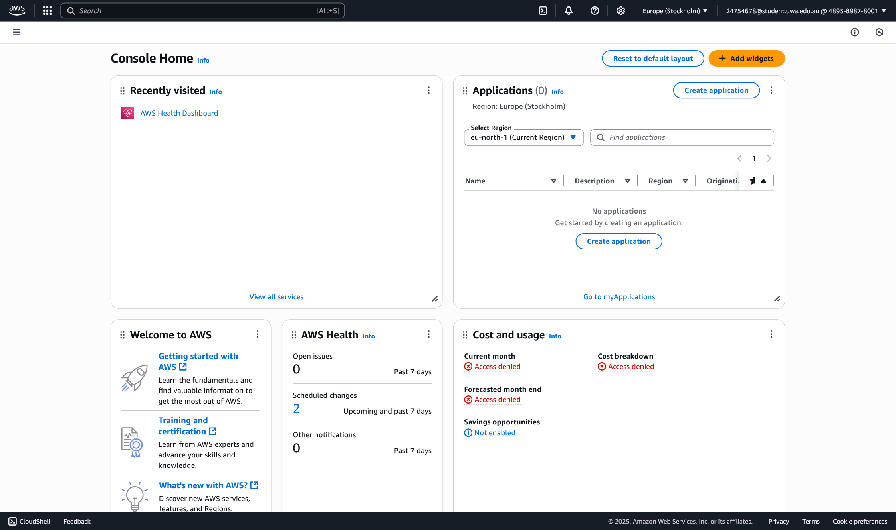

### [2] Search and open Identity Access Management

- Search for IAM

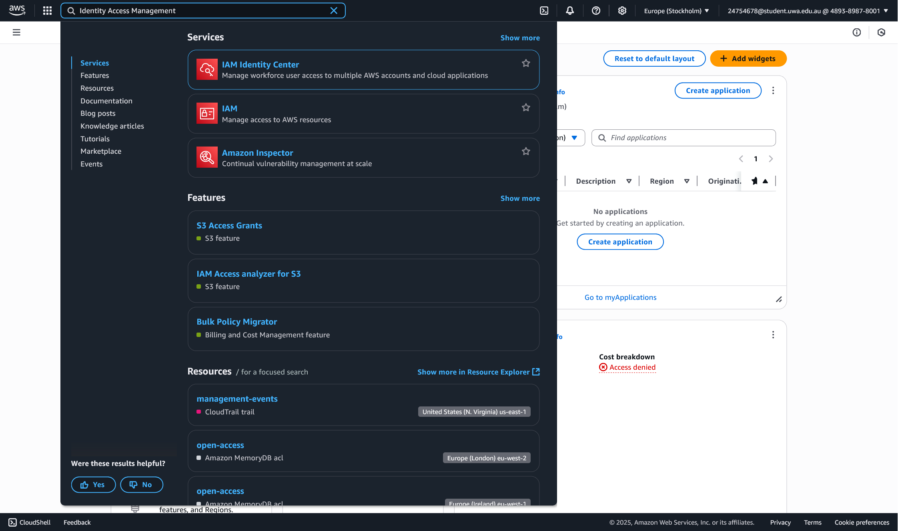

- Open the IAM service

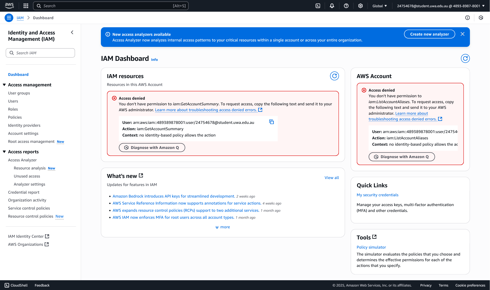

- Open the Security Credentials tab, and create an access key.

  - First choose CLI as use case

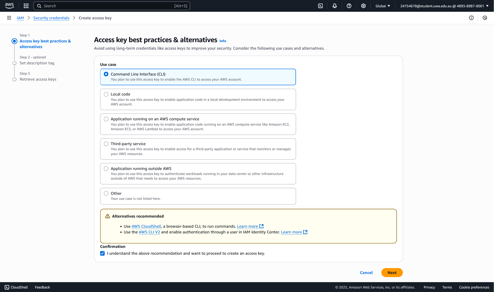

  - Name "lab1-key-for-awscli" to tag the usage

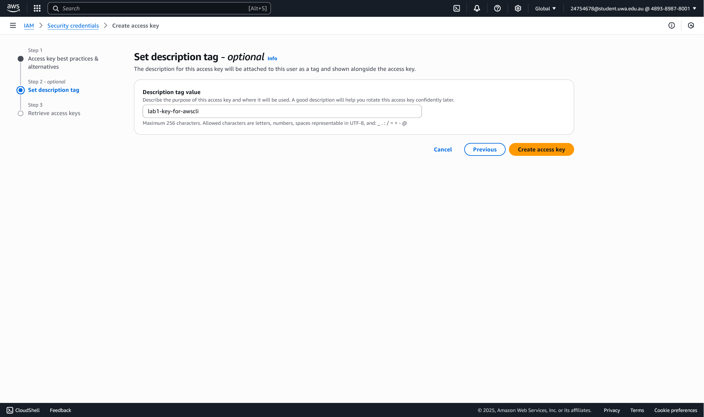

  - Finally be able to retrieve the Access key ID and the Secret access key. Actually the tag stage is useless due to lack of permissions.
  
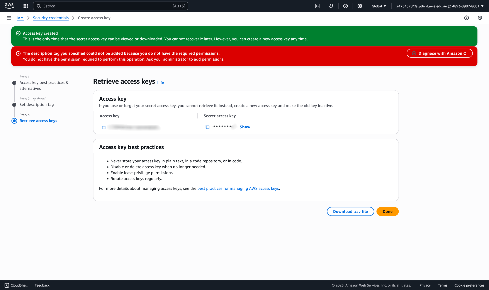

  - Check the access key is valid online

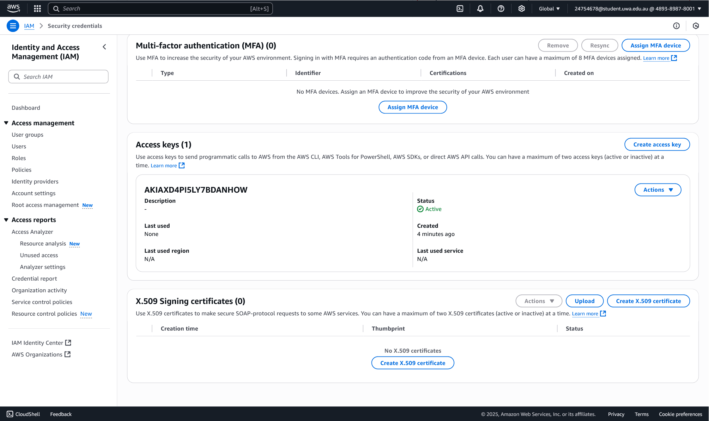

## Set up recent Unix-like OSes

I have a PVE as home-lab server so I just create a PXC container with Ubuntu 22.04 LTS. However since it just going to be a control plane, I don't give it too much resources. It is just an unprivileged container with unlimited cores and 1GB memory.

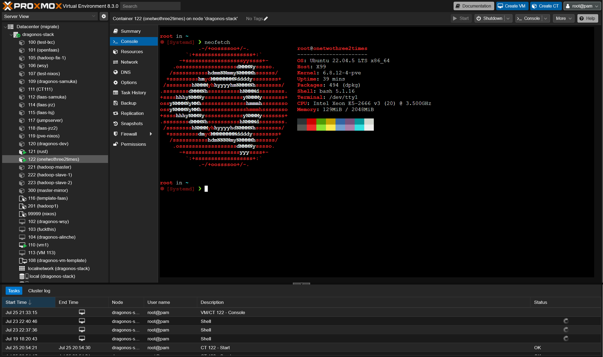

## Install Linux packages

### [1] Install Python

Ubuntu 22.04 LTS does come with Python 3.10 pre-installed, so I don't need to install it again. Just install the pip3 package manager.

__Command:__

```bash
root in 🌐 awscli in ~ took 1m7s
⬢ [Systemd] ❯ python3 -V
Python 3.10.12
```

__Explaination:__
- `-V`: is used to print the version of Python installed. Same as `--version`.

__Command:__

```bash
root in 🌐 awscli in ~
⬢ [Systemd] ❯ apt install -y python3-pip
# Output is omitted.
```

__Explaination:__
- `-y`: is used to automatically answer "yes" to prompts during installation, allowing the installation to proceed without manual intervention.

### [2] Install awscli

`awscli` _"provides a unified command line interface to Amazon Web Services."_

__Since installing global packages with system package manager is recommended, but to track the latest version, we have to use pip3 to upgrade it to the latest version.__

So we first install the `awscli` package from the Ubuntu repository.

__Command:__

```bash
root in 🌐 awscli in ~ took 36s
⬢ [Systemd] ❯ apt install awscli
# Output is truncated...
# Setting up awscli (1.22.34-1) ...
```

Then upgrade it using pip3.

__Command:__

```bash
root in 🌐 awscli in ~ took 24s
⬢ [Systemd] ❯ pip3 install awscli --upgrade
# ...
# Successfully installed awscli-1.41.13 botocore-1.39.13 docutils-0.19 rsa-4.7.2 s3transfer-0.13.1
```

__Explaination:__
- `--upgrade` is used to upgrade the package to the latest version available in the Python Package Index (PyPI).


### [3] Configure AWS

To configure the AWS CLI with the access key and secret access key you created earlier, run `aws configure`.

For my student ID `24754678`, I have Region `eu-north-1` as the default region. For the output format, we choose `json` as it is the most commonly used format for AWS CLI output and easy to parse in Python.

```bash
root in 🌐 awscli in ~ took 7s
⬢ [Systemd] ❯ aws configure
AWS Access Key ID [None]: <Hidden>
AWS Secret Access Key [None]: <Hidden>
Default region name [None]: eu-north-1
Default output format [None]: json
```

### [4] Install boto3

As description, `boto3` SDK _"allows Python developers to write software that makes use of services like Amazon S3 and Amazon EC2."_

We can install it using pip3.

```bash
root in 🌐 awscli in ~ took 5s
⬢ [Systemd] ❯ pip3 install boto3
# ...
# Successfully installed boto3-1.39.13
```

## Test the installed environment

### [1] Test the AWS environment

To test if the AWS CLI is working correctly, you can run the following command to list all available regions:

__Command:__

```bash
aws ec2 describe-regions --output table
```

__Output:__

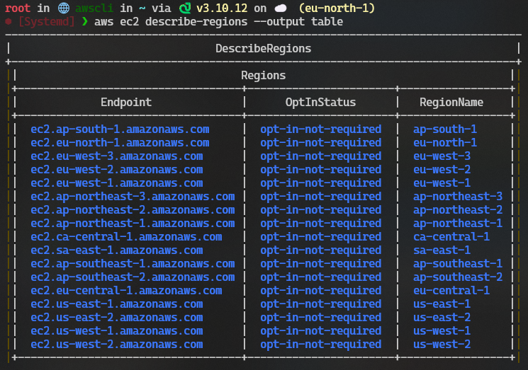

__Explaination:__
- `ec2`: is the service we are interacting with, in this case, the EC2 service.
- `describe-regions`: is the command that retrieves information about the available regions in AWS.
- `--output table`: is used to format the output as a table, making it easier to read.

### [2] Test the Python environment

Now we test the same functionality, but using Python API with the `boto3` library.

__Result:__

```bash
root in 🌐 awscli in ~ on ☁️  (eu-north-1)
⬢ [Systemd] ❯ python3
Python 3.10.12 (main, May 27 2025, 17:12:29) [GCC 11.4.0] on linux
Type "help", "copyright", "credits" or "license" for more information.
>>> import boto3
>>> ec2 = boto3.client('ec2')
>>> response = ec2.describe_regions()
>>> print(response)
{'Regions': [{'OptInStatus': 'opt-in-not-required', 'RegionName': 'ap-south-1', 'Endpoint': 'ec2.ap-south-1.amazonaws.com'}, {'OptInStatus': 'opt-in-not-required', 'RegionName': 'eu-north-1', 'Endpoint': 'ec2.eu-north-1.amazonaws.com'}, {'OptInStatus': 'opt-in-not-required', 'RegionName': 'eu-west-3', 'Endpoint': 'ec2.eu-west-3.amazonaws.com'}, {'OptInStatus': 'opt-in-not-required', 'RegionName': 'eu-west-2', 'Endpoint': 'ec2.eu-west-2.amazonaws.com'}, {'OptInStatus': 'opt-in-not-required', 'RegionName': 'eu-west-1', 'Endpoint': 'ec2.eu-west-1.amazonaws.com'}, {'OptInStatus': 'opt-in-not-required', 'RegionName': 'ap-northeast-3', 'Endpoint': 'ec2.ap-northeast-3.amazonaws.com'}, {'OptInStatus': 'opt-in-not-required', 'RegionName': 'ap-northeast-2', 'Endpoint': 'ec2.ap-northeast-2.amazonaws.com'}, {'OptInStatus': 'opt-in-not-required', 'RegionName': 'ap-northeast-1', 'Endpoint': 'ec2.ap-northeast-1.amazonaws.com'}, {'OptInStatus': 'opt-in-not-required', 'RegionName': 'ca-central-1', 'Endpoint': 'ec2.ca-central-1.amazonaws.com'}, {'OptInStatus': 'opt-in-not-required', 'RegionName': 'sa-east-1', 'Endpoint': 'ec2.sa-east-1.amazonaws.com'}, {'OptInStatus': 'opt-in-not-required', 'RegionName': 'ap-southeast-1', 'Endpoint': 'ec2.ap-southeast-1.amazonaws.com'}, {'OptInStatus': 'opt-in-not-required', 'RegionName': 'ap-southeast-2', 'Endpoint': 'ec2.ap-southeast-2.amazonaws.com'}, {'OptInStatus': 'opt-in-not-required', 'RegionName': 'eu-central-1', 'Endpoint': 'ec2.eu-central-1.amazonaws.com'}, {'OptInStatus': 'opt-in-not-required', 'RegionName': 'us-east-1', 'Endpoint': 'ec2.us-east-1.amazonaws.com'}, {'OptInStatus': 'opt-in-not-required', 'RegionName': 'us-east-2', 'Endpoint': 'ec2.us-east-2.amazonaws.com'}, {'OptInStatus': 'opt-in-not-required', 'RegionName': 'us-west-1', 'Endpoint': 'ec2.us-west-1.amazonaws.com'}, {'OptInStatus': 'opt-in-not-required', 'RegionName': 'us-west-2', 'Endpoint': 'ec2.us-west-2.amazonaws.com'}], 'ResponseMetadata': {'RequestId': 'b519dc15-0ede-4b59-b7b1-1519460f0a8e', 'HTTPStatusCode': 200, 'HTTPHeaders': {'x-amzn-requestid': 'b519dc15-0ede-4b59-b7b1-1519460f0a8e', 'cache-control': 'no-cache, no-store', 'strict-transport-security': 'max-age=31536000; includeSubDomains', 'vary': 'accept-encoding', 'content-type': 'text/xml;charset=UTF-8', 'content-length': '2890', 'date': 'Fri, 25 Jul 2025 16:18:58 GMT', 'server': 'AmazonEC2'}, 'RetryAttempts': 0}}
>>>
[1]+  Stopped                 python3
```

__Explaination:__
- `boto3.client('ec2')`: creates a low-level service client by name, in this case, the EC2 service.
- `ec2.describe_regions()`: calls the `describe_regions` method on the EC2 client to retrieve information about the available regions.  

### [3] Write a Python script

To tabulate the un-tabulated response above to have **2 columns** with **Endpoint** and **RegionName**, I simply print it in a formatted way.

Here we iterate through the `regions` list and print each region's `Endpoint` and `RegionName` formatted.

__Script:__

```python
import boto3
ec2 = boto3.client('ec2')
response = ec2.describe_regions()
regions = response['Regions']
print(f"{'Endpoint':<35} {'RegionName':<15}")
for region in regions:
    print(f"{region['Endpoint']:<35} {region['RegionName']:<15}")
```

__Result:__

```
root in 🌐 awscli in ~ via 🐍 v3.10.12 on ☁️  (eu-north-1)
✦2 ⬢ [Systemd] ❯ python3 tabulated.py
Endpoint                            RegionName
ec2.ap-south-1.amazonaws.com        ap-south-1
ec2.eu-north-1.amazonaws.com        eu-north-1
ec2.eu-west-3.amazonaws.com         eu-west-3
ec2.eu-west-2.amazonaws.com         eu-west-2
ec2.eu-west-1.amazonaws.com         eu-west-1
ec2.ap-northeast-3.amazonaws.com    ap-northeast-3
ec2.ap-northeast-2.amazonaws.com    ap-northeast-2
ec2.ap-northeast-1.amazonaws.com    ap-northeast-1
ec2.ca-central-1.amazonaws.com      ca-central-1
ec2.sa-east-1.amazonaws.com         sa-east-1
ec2.ap-southeast-1.amazonaws.com    ap-southeast-1
ec2.ap-southeast-2.amazonaws.com    ap-southeast-2
ec2.eu-central-1.amazonaws.com      eu-central-1
ec2.us-east-1.amazonaws.com         us-east-1
ec2.us-east-2.amazonaws.com         us-east-2
ec2.us-west-1.amazonaws.com         us-west-1
ec2.us-west-2.amazonaws.com         us-west-2
```

__Explaination:__
- `f"{'Endpoint':<35} {'RegionName':<15}"`: formats with left alignment and specified widths for each column. 

<div style="page-break-after: always;"></div>

# Lab 2

## Create an EC2 instance using awscli
### [1] Create a security group

__Command:__
```
aws ec2 create-security-group --group-name 24754678-sg --description "security group for development environment"
```

This will use the default VPC (if you want to specify a VPC, use `--vpc-id vpc-xxxxxxxx`). 

__NOTE: Take a note of the security group id that is created.__

__Output:__
```
root in 🌐 awscli in ~ via 🐍 v3.10.12 on ☁️  (eu-north-1)
⬢ [Systemd] ❯ aws ec2 create-security-group --group-name 24754678-sg --description "security group for development environment"
{
    "GroupId": "sg-0135d28e30a6d8f85",
    "SecurityGroupArn": "arn:aws:ec2:eu-north-1:489389878001:security-group/sg-0135d28e30a6d8f85"
}
```

### [2] Authorise inbound traffic for ssh

__Command:__
```
aws ec2 authorize-security-group-ingress --group-name 24754678-sg --protocol tcp --port 22 --cidr 0.0.0.0/0
```

__Output:__
```bash
root in 🌐 awscli in ~ via 🐍 v3.10.12 on ☁️  (eu-north-1)
⬢ [Systemd] ❯ aws ec2 authorize-security-group-ingress --group-name 24754678-sg --protocol tcp --port 22 --cidr 0.0.0.0/0
{
    "Return": true,
    "SecurityGroupRules": [
        {
            "SecurityGroupRuleId": "sgr-0e05477a6aaf520af",
            "GroupId": "sg-0135d28e30a6d8f85",
            "GroupOwnerId": "489389878001",
            "IsEgress": false,
            "IpProtocol": "tcp",
            "FromPort": 22,
            "ToPort": 22,
            "CidrIpv4": "0.0.0.0/0",
            "SecurityGroupRuleArn": "arn:aws:ec2:eu-north-1:489389878001:security-group-rule/sgr-0e05477a6aaf520af"
        }
    ]
}
```

### [3] Create a key pair

__Command:__
```
aws ec2 create-key-pair --key-name 24754678-key --query 'KeyMaterial' --output text > ~/.ssh/24754678-key.pem
```

__Explaination:__
- `--output text`: gets the key material in plain text format, which is suitable for saving to a file.
- `> ~/.ssh/24754678-key.pem`: redirects the output to a file named `24754678-key.pem` in the `~/.ssh` directory.

__Command:__
```
chmod 400 ~/.ssh/24754678-key.pem
```

__Explaination:__
Changes the permissions of the key file to be read-only for the owner, which is required for SSH to work properly.

### [4] Create the instance 

Based on your region code, find the corresponding ami id in the table above and fill it in the command below:

__Command:__

```
aws ec2 run-instances --image-id ami-042b4708b1d05f512 --security-group-ids 24754678-sg --count 1 --instance-type t3.micro --key-name 24754678-key --query 'Instances[0].InstanceId'
```

__Output:__
```
root in 🌐 awscli in ~ via 🐍 v3.10.12 on ☁️  (eu-north-1) 
⬢ [Systemd] ❯ aws ec2 run-instances --image-id ami-042b4708b1d05f512 --security-group-ids 24754678-sg --count 1 --instance-type t3.micro --key-name 24754678-key --query 'Instances[0].InstanceId'
"i-0c722ae475f8cf7a1"
```

### [5] Add a tag to your Instance

__Command:__
```
aws ec2 create-tags --resources i-0c722ae475f8cf7a1 --tags Key=Name,Value=24754678-vm
```
**NOTE**: If you create a single instance, you must name it using the format of `<student number>-vm` (e.g., 24242424-vm). If you need to create multiple ones, follow the naming format of `<student number>-vm1` and `<student number>-vm2` (e.g., 24242424-vm1, 24242424-vm2).

### [6] Get the public IP address

__Command:__
```
aws ec2 describe-instances --instance-ids i-0c722ae475f8cf7a1 --query 'Reservations[0].Instances[0].PublicIpAddress'
```
__Output:__
```
root in 🌐 awscli in ~ via 🐍 v3.10.12 on ☁️  (eu-north-1) 
⬢ [Systemd] ❯ aws ec2 describe-instances --instance-ids i-0c722ae475f8cf7a1 --query 'Reservations[0].Instances[0].PublicIpAddress'
"16.170.231.242"
```

### [7] Connect to the instance via ssh

__Command:__
```
ssh -i .ssh/24754678-key.pem ubuntu@16.170.231.242
```

__Explaination:__
- `-i .ssh/24754678-key.pem`: specifies the private key file to use for authentication.
- `ubuntu@16.170.231.242`: specifies the user and the public IP address of the instance to connect to.

__Output:__
```
root in 🌐 awscli in ~ via 🐍 v3.10.12 on ☁️ (eu-north-1)
⬢ [Systemd] ❯ ssh -i .ssh/24754678-key.pem ubuntu@16.170.231.242
The authenticity of host '16.170.231.242 (16.170.231.242)' can't be established.
ED25519 key fingerprint is SHA256:rcl2mt4b9dFFnP9t8ETMGVSUn9tYdUV5N0kbwjZYOeM.
This key is not known by any other names
Are you sure you want to continue connecting (yes/no/[fingerprint])? yes
Warning: Permanently added '16.170.231.242' (ED25519) to the list of known hosts.
Welcome to Ubuntu 24.04.2 LTS (GNU/Linux 6.8.0-1029-aws x86_64)

 * Documentation:  https://help.ubuntu.com
 * Management:     https://landscape.canonical.com
 * Support:        https://ubuntu.com/pro

 System information as of Wed Jul 30 12:40:14 UTC 2025

  System load:  0.0               Temperature:           -273.1 C
  Usage of /:   25.3% of 6.71GB   Processes:             106
  Memory usage: 23%               Users logged in:       0
  Swap usage:   0%                IPv4 address for ens5: 172.31.19.236

Expanded Security Maintenance for Applications is not enabled.

0 updates can be applied immediately.

Enable ESM Apps to receive additional future security updates.
See https://ubuntu.com/esm or run: sudo pro status


The list of available updates is more than a week old.
To check for new updates run: sudo apt update


The programs included with the Ubuntu system are free software;
the exact distribution terms for each program are described in the
individual files in /usr/share/doc/*/copyright.

Ubuntu comes with ABSOLUTELY NO WARRANTY, to the extent permitted by
applicable law.

To run a command as administrator (user "root"), use "sudo <command>".
See "man sudo_root" for details.

ubuntu@ip-172-31-19-236:~$
```

### [8] List the created instance using the AWS console

__Command:__
```
aws ec2 describe-instances --instance-ids i-0c722ae475f8cf7a1 --query 'Reservations[0].Instances[0]'
```

__Output:__
```json
{
    "Architecture": "x86_64",
    "BlockDeviceMappings": [
        {
            "DeviceName": "/dev/sda1",
            "Ebs": {
                "AttachTime": "2025-07-30T12:30:52.000Z",
                "DeleteOnTermination": true,
                "Status": "attached",
                "VolumeId": "vol-08d558ef8fa76a5e5"
            }
        }
    ],
    "ClientToken": "9b7d1530-b76c-40a0-b4b4-6a4142796622",
    "EbsOptimized": false,
    "EnaSupport": true,
    "Hypervisor": "xen",
    "NetworkInterfaces": [
        {
            "Association": {
                "IpOwnerId": "amazon",
                "PublicDnsName": "ec2-16-170-231-242.eu-north-1.compute.amazonaws.com",
                "PublicIp": "16.170.231.242"
            },
            "Attachment": {
                "AttachTime": "2025-07-30T12:30:51.000Z",
                "AttachmentId": "eni-attach-0ed4f23866bd8a82f",
                "DeleteOnTermination": true,
                "DeviceIndex": 0,
                "Status": "attached",
                "NetworkCardIndex": 0
            },
            "Description": "",
            "Groups": [
                {
                    "GroupId": "sg-0135d28e30a6d8f85",
                    "GroupName": "24754678-sg"
                }
            ],
            "Ipv6Addresses": [],
            "MacAddress": "06:0b:b8:62:51:f9",
            "NetworkInterfaceId": "eni-08978f0fa0272f5f2",
            "OwnerId": "489389878001",
            "PrivateDnsName": "ip-172-31-19-236.eu-north-1.compute.internal",
            "PrivateIpAddress": "172.31.19.236",
            "PrivateIpAddresses": [
                {
                    "Association": {
                        "IpOwnerId": "amazon",
                        "PublicDnsName": "ec2-16-170-231-242.eu-north-1.compute.amazonaws.com",
                        "PublicIp": "16.170.231.242"
                    },
                    "Primary": true,
                    "PrivateDnsName": "ip-172-31-19-236.eu-north-1.compute.internal",
                    "PrivateIpAddress": "172.31.19.236"
                }
            ],
            "SourceDestCheck": true,
            "Status": "in-use",
            "SubnetId": "subnet-0e6027d8611477c56",
            "VpcId": "vpc-0463b16a2b8c4f564",
            "InterfaceType": "interface",
            "Operator": {
                "Managed": false
            }
        }
    ],
    "RootDeviceName": "/dev/sda1",
    "RootDeviceType": "ebs",
    "SecurityGroups": [
        {
            "GroupId": "sg-0135d28e30a6d8f85",
            "GroupName": "24754678-sg"
        }
    ],
    "SourceDestCheck": true,
    "Tags": [
        {
            "Key": "Name",
            "Value": "24754678-vm"
        }
    ],
    "VirtualizationType": "hvm",
    "CpuOptions": {
        "CoreCount": 1,
        "ThreadsPerCore": 2
    },
    "CapacityReservationSpecification": {
        "CapacityReservationPreference": "open"
    },
    "HibernationOptions": {
        "Configured": false
    },
    "MetadataOptions": {
        "State": "applied",
        "HttpTokens": "required",
        "HttpPutResponseHopLimit": 2,
        "HttpEndpoint": "enabled",
        "HttpProtocolIpv6": "disabled",
        "InstanceMetadataTags": "disabled"
    },
    "EnclaveOptions": {
        "Enabled": false
    },
    "BootMode": "uefi-preferred",
    "PlatformDetails": "Linux/UNIX",
    "UsageOperation": "RunInstances",
    "UsageOperationUpdateTime": "2025-07-30T12:30:51.000Z",
    "PrivateDnsNameOptions": {
        "HostnameType": "ip-name",
        "EnableResourceNameDnsARecord": false,
        "EnableResourceNameDnsAAAARecord": false
    },
    "MaintenanceOptions": {
        "AutoRecovery": "default",
        "RebootMigration": "default"
    },
    "CurrentInstanceBootMode": "uefi",
    "NetworkPerformanceOptions": {
        "BandwidthWeighting": "default"
    },
    "Operator": {
        "Managed": false
    },
    "InstanceId": "i-0c722ae475f8cf7a1",
    "ImageId": "ami-042b4708b1d05f512",
    "State": {
        "Code": 16,
        "Name": "running"
    },
    "PrivateDnsName": "ip-172-31-19-236.eu-north-1.compute.internal",
    "PublicDnsName": "ec2-16-170-231-242.eu-north-1.compute.amazonaws.com",
    "StateTransitionReason": "",
    "KeyName": "24754678-key",
    "AmiLaunchIndex": 0,
    "ProductCodes": [],
    "InstanceType": "t3.micro",
    "LaunchTime": "2025-07-30T12:30:51.000Z",
    "Placement": {
        "GroupName": "",
        "Tenancy": "default",
        "AvailabilityZone": "eu-north-1a"
    },
    "Monitoring": {
        "State": "disabled"
    },
    "SubnetId": "subnet-0e6027d8611477c56",
    "VpcId": "vpc-0463b16a2b8c4f564",
    "PrivateIpAddress": "172.31.19.236",
    "PublicIpAddress": "16.170.231.242"
}

```

## Create an EC2 instance with Python Boto3

Use a Python script to implement the steps above (steps 1-6 are required, repeat step 8 using the AWS console again; Step 7 is optional). Refer to [page](https://boto3.amazonaws.com/v1/documentation/api/latest/reference/services/ec2.html) for details. 

**NOTE**: Remember that your security group name, key pair name, and instance name should be different from those used in **Create an EC2 instance using awscli**.

__Script:__

```python
#!/usr/bin/env python3

import boto3
import os
import time
from botocore.exceptions import ClientError

class EC2Manager:
    def __init__(self, student_number: str, tag: str = ""):
        self.ec2_client = boto3.client('ec2')
        self.ec2_resource = boto3.resource('ec2')
        self.student_number = student_number
        self.tag = tag
        
        # Resource names
        self.security_group_name = f"{student_number}-sg{tag}"
        self.key_pair_name = f"{student_number}-key{tag}"
        self.instance_name = f"{student_number}-vm{tag}"
        self.key_file_path = os.path.expanduser(f"~/.ssh/{self.key_pair_name}.pem")
        
        # Configuration
        self.ami_id = "ami-042b4708b1d05f512"  # Ubuntu 24.04 LTS for eu-north-1
        self.instance_type = "t3.micro"
        
        # Store created resources
        self.security_group_id = None
        self.instance_id = None
        self.public_ip = None
        
        # Track rollback operations (Rollback)
        self.rollback_operations = []
        self.created_resources = {
            'security_group': False,
            'ssh_rule': False,
            'key_pair': False,
            'key_file': False,
            'instance': False,
            'tags': False
        }

    def create_security_group(self):
        """Step 1: Create a security group"""
        print("Step 1: Creating security group...")
        try:
            response = self.ec2_client.create_security_group(
                GroupName=self.security_group_name,
                Description="security group for python development environment"
            )
            self.security_group_id = response['GroupId']
            self.created_resources['security_group'] = True
            self.rollback_operations.append(('security_group', self.rollback_security_group))
            print(f"✓ Security group created: {self.security_group_id}")
            print(f"  ARN: {response.get('SecurityGroupArn', 'N/A')}")
            return True
        except ClientError as e:
            print(f"✗ Error creating security group: {e}")
            return False

    def rollback_security_group(self):
        """Rollback: Delete security group"""
        if self.security_group_id and self.created_resources['security_group']:
            try:
                # Wait a bit for dependencies to be removed
                time.sleep(5)
                self.ec2_client.delete_security_group(GroupId=self.security_group_id)
                print(f"🔄 Rollback: Security group {self.security_group_id} deleted")
                self.created_resources['security_group'] = False
                return True
            except ClientError as e:
                print(f"✗ Rollback failed - Error deleting security group: {e}")
                return False
        return True

    def authorize_ssh_access(self):
        """Step 2: Authorize inbound traffic for SSH"""
        print("\nStep 2: Authorizing inbound SSH traffic...")
        try:
            response = self.ec2_client.authorize_security_group_ingress(
                GroupName=self.security_group_name,
                IpPermissions=[
                    {
                        'IpProtocol': 'tcp',
                        'FromPort': 22,
                        'ToPort': 22,
                        'IpRanges': [{'CidrIp': '0.0.0.0/0'}]
                    }
                ]
            )
            self.created_resources['ssh_rule'] = True
            self.rollback_operations.append(('ssh_rule', self.rollback_ssh_rule))
            print("✓ SSH access authorized successfully")
            if 'SecurityGroupRules' in response:
                for rule in response['SecurityGroupRules']:
                    print(f"  Rule ID: {rule.get('SecurityGroupRuleId')}")
            return True
        except ClientError as e:
            print(f"✗ Error authorizing SSH access: {e}")
            return False

    def rollback_ssh_rule(self):
        """Rollback: Remove SSH rule from security group"""
        if self.security_group_id and self.created_resources['ssh_rule']:
            try:
                self.ec2_client.revoke_security_group_ingress(
                    GroupName=self.security_group_name,
                    IpPermissions=[
                        {
                            'IpProtocol': 'tcp',
                            'FromPort': 22,
                            'ToPort': 22,
                            'IpRanges': [{'CidrIp': '0.0.0.0/0'}]
                        }
                    ]
                )
                print(f"🔄 Rollback: SSH rule removed from security group")
                self.created_resources['ssh_rule'] = False
                return True
            except ClientError as e:
                print(f"✗ Rollback failed - Error removing SSH rule: {e}")
                return False
        return True

    def create_key_pair(self):
        """Step 3: Create a key pair"""
        print("\nStep 3: Creating key pair...")
        try:
            response = self.ec2_client.create_key_pair(KeyName=self.key_pair_name)
            key_material = response['KeyMaterial']
            
            # Create directory if it doesn't exist
            os.makedirs(os.path.dirname(self.key_file_path), exist_ok=True)
            
            # Save key to file
            with open(self.key_file_path, 'w') as key_file:
                key_file.write(key_material)
            
            # Set proper permissions (equivalent to chmod 400)
            os.chmod(self.key_file_path, 0o400)
            
            self.created_resources['key_pair'] = True
            self.created_resources['key_file'] = True
            self.rollback_operations.append(('key_pair', self.rollback_key_pair))
            
            print(f"✓ Key pair created and saved to: {self.key_file_path}")
            print(f"  Key fingerprint: {response.get('KeyFingerprint', 'N/A')}")
            return True
        except ClientError as e:
            print(f"✗ Error creating key pair: {e}")
            return False

    def rollback_key_pair(self):
        """Rollback: Delete key pair and key file"""
        success = True
        
        # Delete key pair from AWS
        if self.created_resources['key_pair']:
            try:
                self.ec2_client.delete_key_pair(KeyName=self.key_pair_name)
                print(f"🔄 Rollback: Key pair {self.key_pair_name} deleted from AWS")
                self.created_resources['key_pair'] = False
            except ClientError as e:
                print(f"✗ Rollback failed - Error deleting key pair: {e}")
                success = False
        
        # Delete key file from local system
        if self.created_resources['key_file'] and os.path.exists(self.key_file_path):
            try:
                os.remove(self.key_file_path)
                print(f"🔄 Rollback: Key file {self.key_file_path} removed")
                self.created_resources['key_file'] = False
            except Exception as e:
                print(f"✗ Rollback failed - Error removing key file: {e}")
                success = False
        
        return success

    def create_instance(self):
        """Step 4: Create the EC2 instance"""
        print("\nStep 4: Creating EC2 instance...")
        try:
            response = self.ec2_client.run_instances(
                ImageId=self.ami_id,
                MinCount=1,
                MaxCount=1,
                InstanceType=self.instance_type,
                KeyName=self.key_pair_name,
                SecurityGroupIds=[self.security_group_id]
            )
            
            self.instance_id = response['Instances'][0]['InstanceId']
            self.created_resources['instance'] = True
            self.rollback_operations.append(('instance', self.rollback_instance))
            
            print(f"✓ Instance created: {self.instance_id}")
            print(f"  Instance type: {self.instance_type}")
            print(f"  AMI ID: {self.ami_id}")
            return True
        except ClientError as e:
            print(f"✗ Error creating instance: {e}")
            return False

    def rollback_instance(self):
        """Rollback: Terminate EC2 instance"""
        if self.instance_id and self.created_resources['instance']:
            try:
                self.ec2_client.terminate_instances(InstanceIds=[self.instance_id])
                print(f"🔄 Rollback: Instance {self.instance_id} termination initiated")
                
                # Wait for termination to complete
                print("   Waiting for instance to terminate...")
                waiter = self.ec2_client.get_waiter('instance_terminated')
                waiter.wait(
                    InstanceIds=[self.instance_id],
                    WaiterConfig={'Delay': 5, 'MaxAttempts': 40}
                )
                print(f"🔄 Rollback: Instance {self.instance_id} terminated")
                self.created_resources['instance'] = False
                return True
            except ClientError as e:
                print(f"✗ Rollback failed - Error terminating instance: {e}")
                return False
        return True

    def tag_instance(self):
        """Step 5: Add a tag to the instance"""
        print("\nStep 5: Adding name tag to instance...")
        try:
            self.ec2_client.create_tags(
                Resources=[self.instance_id],
                Tags=[
                    {
                        'Key': 'Name',
                        'Value': self.instance_name
                    }
                ]
            )
            self.created_resources['tags'] = True
            self.rollback_operations.append(('tags', self.rollback_tags))
            
            print(f"✓ Instance tagged with name: {self.instance_name}")
            return True
        except ClientError as e:
            print(f"✗ Error tagging instance: {e}")
            return False

    def rollback_tags(self):
        """Rollback: Remove tags from instance"""
        if self.instance_id and self.created_resources['tags']:
            try:
                self.ec2_client.delete_tags(
                    Resources=[self.instance_id],
                    Tags=[
                        {
                            'Key': 'Name',
                            'Value': self.instance_name
                        }
                    ]
                )
                print(f"🔄 Rollback: Tags removed from instance {self.instance_id}")
                self.created_resources['tags'] = False
                return True
            except ClientError as e:
                print(f"✗ Rollback failed - Error removing tags: {e}")
                return False
        return True

    def wait_for_instance_running(self):
        """Wait for instance to be in running state"""
        print("\nWaiting for instance to be in running state...")
        try:
            waiter = self.ec2_client.get_waiter('instance_running')
            waiter.wait(
                InstanceIds=[self.instance_id],
                WaiterConfig={
                    'Delay': 5,
                    'MaxAttempts': 40
                }
            )
            print("✓ Instance is now running!")
            return True
        except Exception as e:
            print(f"✗ Error waiting for instance: {e}")
            return False

    def get_public_ip(self):
        """Step 6: Get the public IP address"""
        print("\nStep 6: Getting public IP address...")
        try:
            response = self.ec2_client.describe_instances(InstanceIds=[self.instance_id])
            instance_data = response['Reservations'][0]['Instances'][0]
            self.public_ip = instance_data.get('PublicIpAddress')
            
            if self.public_ip:
                print(f"✓ Public IP address: {self.public_ip}")
                return True
            else:
                print("⚠ No public IP address assigned")
                return False
        except ClientError as e:
            print(f"✗ Error getting public IP: {e}")
            return False

    def print_ssh_command(self):
        """Step 7: Print SSH connection command"""
        if self.public_ip:
            print(f"\nStep 7: To connect via SSH, use:")
            print(f"ssh -i {self.key_file_path} ubuntu@{self.public_ip}")

    def print_summary(self):
        """Print a summary of created resources"""
        print("\n" + "="*60)
        print("RESOURCE SUMMARY:")
        print("="*60)
        print(f"Security Group: {self.security_group_name} ({self.security_group_id})")
        print(f"Key Pair: {self.key_pair_name}")
        print(f"Key File: {self.key_file_path}")
        print(f"Instance: {self.instance_name} ({self.instance_id})")
        print(f"Public IP: {self.public_ip}")
        if self.public_ip:
            print(f"SSH Command: ssh -i {self.key_file_path} ubuntu@{self.public_ip}")
        print("="*60)

    def cleanup_resources(self):
        """Clean up created resources (for testing purposes)"""
        print("\n🔄 Performing complete rollback of all resources...")
        self.perform_rollback()

    def perform_rollback(self):
        """执行Rollback - Perform rollback operations in reverse order"""
        print(f"\n🔄 Starting rollback process... ({len(self.rollback_operations)} operations to undo)")
        
        # Perform rollback operations in reverse order
        success_count = 0
        total_operations = len(self.rollback_operations)
        
        for i, (operation_name, rollback_func) in enumerate(reversed(self.rollback_operations)):
            print(f"\n🔄 Rollback step {i+1}/{total_operations}: {operation_name}")
            try:
                if rollback_func():
                    success_count += 1
                else:
                    print(f"⚠️  Rollback step failed: {operation_name}")
            except Exception as e:
                print(f"✗ Rollback error for {operation_name}: {e}")
        
        print(f"\n🔄 Rollback completed: {success_count}/{total_operations} operations successful")
        
        # Clear rollback operations
        self.rollback_operations.clear()
        
        # Reset created resources tracking
        for key in self.created_resources:
            self.created_resources[key] = False
        
        return success_count == total_operations

    def partial_rollback_from_step(self, step_name):
        """执行从指定步骤开始的部分回退 - Perform partial rollback from a specific step"""
        print(f"\n🔄 Performing partial rollback from step: {step_name}")
        
        # Find the index of the step to rollback from
        step_index = -1
        for i, (operation_name, _) in enumerate(self.rollback_operations):
            if operation_name == step_name:
                step_index = i
                break
        
        if step_index == -1:
            print(f"⚠️  Step '{step_name}' not found in rollback operations")
            return False
        
        # Perform rollback from the found step onwards (in reverse order)
        operations_to_rollback = self.rollback_operations[step_index:]
        operations_to_rollback.reverse()
        
        success_count = 0
        total_operations = len(operations_to_rollback)
        
        for i, (operation_name, rollback_func) in enumerate(operations_to_rollback):
            print(f"\n🔄 Partial rollback step {i+1}/{total_operations}: {operation_name}")
            try:
                if rollback_func():
                    success_count += 1
                else:
                    print(f"⚠️  Partial rollback step failed: {operation_name}")
            except Exception as e:
                print(f"✗ Partial rollback error for {operation_name}: {e}")
        
        # Remove the rolled back operations from the list
        self.rollback_operations = self.rollback_operations[:step_index]
        
        print(f"\n🔄 Partial rollback completed: {success_count}/{total_operations} operations successful")
        return success_count == total_operations

def main():
    """Main function to create EC2 instance"""
    ec2_manager = EC2Manager(student_number="24754678", tag="2")
    
    # Execute all steps
    steps = [
        ('create_security_group', ec2_manager.create_security_group),
        ('authorize_ssh_access', ec2_manager.authorize_ssh_access),
        ('create_key_pair', ec2_manager.create_key_pair),
        ('create_instance', ec2_manager.create_instance),
        ('tag_instance', ec2_manager.tag_instance),
        ('wait_for_instance_running', ec2_manager.wait_for_instance_running),
        ('get_public_ip', ec2_manager.get_public_ip),
    ]
    
    # Execute steps sequentially with rollback on failure
    completed_steps = 0
    for step_name, step_func in steps:
        try:
            if not step_func():
                print(f"❌ Failed at step: {step_name}")
                print(f"🔄 Initiating rollback from step: {step_name}")
                # Perform rollback of completed steps
                ec2_manager.perform_rollback()
                return 1
            completed_steps += 1
        except Exception as e:
            print(f"❌ Exception in step {step_name}: {e}")
            print(f"🔄 Initiating rollback from step: {step_name}")
            ec2_manager.perform_rollback()
            return 1
    
    try:
        # Optional steps (no rollback needed for these)
        ec2_manager.print_ssh_command()
        
        ec2_manager.print_summary()
        
        print("\n✅ All steps completed successfully!")
        
    except Exception as e:
        print(f"⚠️  Warning: Error in optional steps: {e}")
        print("✅ Core EC2 instance creation was successful")
    
    return 0

if __name__ == "__main__":
    exit(main())

```

__Output:__

```
root in 🌐 awscli in ~ via 🐍 v3.10.12 on ☁️  (eu-north-1) 
⬢ [Systemd] ❯ /bin/python3 /root/ec2_manager_vm2.py
Step 1: Creating security group...
✓ Security group created: sg-0552b1c5ed6779a88
  ARN: arn:aws:ec2:eu-north-1:489389878001:security-group/sg-0552b1c5ed6779a88

Step 2: Authorizing inbound SSH traffic...
✓ SSH access authorized successfully
  Rule ID: sgr-09ea4d592ea14e933

Step 3: Creating key pair...
✓ Key pair created and saved to: /root/.ssh/24754678-key2.pem
  Key fingerprint: fc:f3:1e:0b:b4:b9:d1:14:fd:98:cd:1b:dd:be:22:16:08:1f:1f:45

Step 4: Creating EC2 instance...
✓ Instance created: i-07a431a9b7fa47dea
  Instance type: t3.micro
  AMI ID: ami-042b4708b1d05f512

Step 5: Adding name tag to instance...
✓ Instance tagged with name: 24754678-vm2

Waiting for instance to be in running state...
✓ Instance is now running!

Step 6: Getting public IP address...
✓ Public IP address: 16.171.206.24

Step 7: To connect via SSH, use:
ssh -i /root/.ssh/24754678-key2.pem ubuntu@16.171.206.24

============================================================
RESOURCE SUMMARY:
============================================================
Security Group: 24754678-sg2 (sg-0552b1c5ed6779a88)
Key Pair: 24754678-key2
Key File: /root/.ssh/24754678-key2.pem
Instance: 24754678-vm2 (i-07a431a9b7fa47dea)
Public IP: 16.171.206.24
SSH Command: ssh -i /root/.ssh/24754678-key2.pem ubuntu@16.171.206.24
============================================================

✅ All steps completed successfully!
```

Verify details of the created instance using the AWS console:

__Command:__

```bash
aws ec2 describe-instances --instance-ids i-07a431a9b7fa47dea --query 'Reservations[0].Instances[0]'
```

__Output:__
```json
{
    "Architecture": "x86_64",
    "BlockDeviceMappings": [
        {
            "DeviceName": "/dev/sda1",
            "Ebs": {
                "AttachTime": "2025-07-30T13:24:28.000Z",
                "DeleteOnTermination": true,
                "Status": "attached",
                "VolumeId": "vol-0a1fa829c2bb89781"
            }
        }
    ],
    "ClientToken": "54c176e0-f606-491a-ae58-1fa3a2a6b458",
    "EbsOptimized": false,
    "EnaSupport": true,
    "Hypervisor": "xen",
    "NetworkInterfaces": [
        {
            "Association": {
                "IpOwnerId": "amazon",
                "PublicDnsName": "ec2-16-171-206-24.eu-north-1.compute.amazonaws.com",
                "PublicIp": "16.171.206.24"
            },
            "Attachment": {
                "AttachTime": "2025-07-30T13:24:27.000Z",
                "AttachmentId": "eni-attach-0e428eaae5fc4100d",
                "DeleteOnTermination": true,
                "DeviceIndex": 0,
                "Status": "attached",
                "NetworkCardIndex": 0
            },
            "Description": "",
            "Groups": [
                {
                    "GroupId": "sg-0552b1c5ed6779a88",
                    "GroupName": "24754678-sg2"
                }
            ],
            "Ipv6Addresses": [],
            "MacAddress": "0a:62:0b:43:1c:ab",
            "NetworkInterfaceId": "eni-078580b4d85797b85",
            "OwnerId": "489389878001",
            "PrivateDnsName": "ip-172-31-37-195.eu-north-1.compute.internal",
            "PrivateIpAddress": "172.31.37.195",
            "PrivateIpAddresses": [
                {
                    "Association": {
                        "IpOwnerId": "amazon",
                        "PublicDnsName": "ec2-16-171-206-24.eu-north-1.compute.amazonaws.com",
                        "PublicIp": "16.171.206.24"
                    },
                    "Primary": true,
                    "PrivateDnsName": "ip-172-31-37-195.eu-north-1.compute.internal",
                    "PrivateIpAddress": "172.31.37.195"
                }
            ],
            "SourceDestCheck": true,
            "Status": "in-use",
            "SubnetId": "subnet-03aab81e969635318",
            "VpcId": "vpc-0463b16a2b8c4f564",
            "InterfaceType": "interface",
            "Operator": {
                "Managed": false
            }
        }
    ],
    "RootDeviceName": "/dev/sda1",
    "RootDeviceType": "ebs",
    "SecurityGroups": [
        {
            "GroupId": "sg-0552b1c5ed6779a88",
            "GroupName": "24754678-sg2"
        }
    ],
    "SourceDestCheck": true,
    "Tags": [
        {
            "Key": "Name",
            "Value": "24754678-vm2"
        }
    ],
    "VirtualizationType": "hvm",
    "CpuOptions": {
        "CoreCount": 1,
        "ThreadsPerCore": 2
    },
    "CapacityReservationSpecification": {
        "CapacityReservationPreference": "open"
    },
    "HibernationOptions": {
        "Configured": false
    },
    "MetadataOptions": {
        "State": "applied",
        "HttpTokens": "required",
        "HttpPutResponseHopLimit": 2,
        "HttpEndpoint": "enabled",
        "HttpProtocolIpv6": "disabled",
        "InstanceMetadataTags": "disabled"
    },
    "EnclaveOptions": {
        "Enabled": false
    },
    "BootMode": "uefi-preferred",
    "PlatformDetails": "Linux/UNIX",
    "UsageOperation": "RunInstances",
    "UsageOperationUpdateTime": "2025-07-30T13:24:27.000Z",
    "PrivateDnsNameOptions": {
        "HostnameType": "ip-name",
        "EnableResourceNameDnsARecord": false,
        "EnableResourceNameDnsAAAARecord": false
    },
    "MaintenanceOptions": {
        "AutoRecovery": "default",
        "RebootMigration": "default"
    },
    "CurrentInstanceBootMode": "uefi",
    "NetworkPerformanceOptions": {
        "BandwidthWeighting": "default"
    },
    "Operator": {
        "Managed": false
    },
    "InstanceId": "i-07a431a9b7fa47dea",
    "ImageId": "ami-042b4708b1d05f512",
    "State": {
        "Code": 16,
        "Name": "running"
    },
    "PrivateDnsName": "ip-172-31-37-195.eu-north-1.compute.internal",
    "PublicDnsName": "ec2-16-171-206-24.eu-north-1.compute.amazonaws.com",
    "StateTransitionReason": "",
    "KeyName": "24754678-key2",
    "AmiLaunchIndex": 0,
    "ProductCodes": [],
    "InstanceType": "t3.micro",
    "LaunchTime": "2025-07-30T13:24:27.000Z",
    "Placement": {
        "GroupName": "",
        "Tenancy": "default",
        "AvailabilityZone": "eu-north-1b"
    },
    "Monitoring": {
        "State": "disabled"
    },
    "SubnetId": "subnet-03aab81e969635318",
    "VpcId": "vpc-0463b16a2b8c4f564",
    "PrivateIpAddress": "172.31.37.195",
    "PublicIpAddress": "16.171.206.24"
}

```

Verify if we can SSH into the created instance:

```
root in 🌐 awscli in ~ via 🐍 v3.10.12 on ☁️  (eu-north-1) took 12s 
⬢ [Systemd] ❯ ssh -i /root/.ssh/24754678-key2.pem ubuntu@16.171.206.24
The authenticity of host '16.171.206.24 (16.171.206.24)' can't be established.
ED25519 key fingerprint is SHA256:iXSagyx+0la91WSzACln2wNkfMRuZGpEHAPb+5OkMfQ.
This key is not known by any other names
Are you sure you want to continue connecting (yes/no/[fingerprint])? yes
Warning: Permanently added '16.171.206.24' (ED25519) to the list of known hosts.
Welcome to Ubuntu 24.04.2 LTS (GNU/Linux 6.8.0-1029-aws x86_64)

 * Documentation:  https://help.ubuntu.com
 * Management:     https://landscape.canonical.com
 * Support:        https://ubuntu.com/pro

 System information as of Wed Jul 30 13:27:33 UTC 2025

  System load:  0.04              Temperature:           -273.1 C
  Usage of /:   25.3% of 6.71GB   Processes:             112
  Memory usage: 24%               Users logged in:       0
  Swap usage:   0%                IPv4 address for ens5: 172.31.37.195

Expanded Security Maintenance for Applications is not enabled.

0 updates can be applied immediately.

Enable ESM Apps to receive additional future security updates.
See https://ubuntu.com/esm or run: sudo pro status


The list of available updates is more than a week old.
To check for new updates run: sudo apt update


The programs included with the Ubuntu system are free software;
the exact distribution terms for each program are described in the
individual files in /usr/share/doc/*/copyright.

Ubuntu comes with ABSOLUTELY NO WARRANTY, to the extent permitted by
applicable law.

To run a command as administrator (user "root"), use "sudo <command>".
See "man sudo_root" for details.

ubuntu@ip-172-31-37-195:~$ 
```

## Install Docker

> Following [Install Docker Engine on Ubuntu | Docker Docs](https://docs.docker.com/engine/install/ubuntu/)

### [1] Install Docker
Set up Docker's apt repository.
```bash
apt-get update
apt-get install ca-certificates curl
install -m 0755 -d /etc/apt/keyrings
curl -fsSL https://download.docker.com/linux/ubuntu/gpg -o /etc/apt/keyrings/docker.asc
chmod a+r /etc/apt/keyrings/docker.asc

# Add the repository to Apt sources:
echo \
  "deb [arch=$(dpkg --print-architecture) signed-by=/etc/apt/keyrings/docker.asc] https://download.docker.com/linux/ubuntu \
  $(. /etc/os-release && echo "${UBUNTU_CODENAME:-$VERSION_CODENAME}") stable" | \
  tee /etc/apt/sources.list.d/docker.list > /dev/null
apt-get update
apt-get install docker-ce docker-ce-cli containerd.io docker-buildx-plugin docker-compose-plugin -y
```

### Check the version

```
docker --version
```

## Build and run an httpd container

Create a directory called html.

Edit a file index.html inside the html directory and add the following content:

```
  <html>
    <head> </head>
    <body>
      <p>Hello! This is Samuka007!</p>
    </body>
  </html>
```

Create a file called Dockerfile outside the html directory with the following content:

```
FROM httpd:2.4
COPY ./html/ /usr/local/apache2/htdocs/
```

Build a docker image.

```
docker build -t my-apache2 .
```

__Output:__

```
root in 🌐 awscli in ~/httpd on ☁️  (eu-north-1) 
⬢ [Systemd] ❯ docker build -t my-apache2 .
[+] Building 18.3s (7/7) 
# ...truncated for brevity...
 => [internal] load build definition from Dockerfile
 => [2/2] COPY ./html/ /usr/local/apache2/htdocs/
 => exporting to image
 => => exporting layers
 => => writing image sha256:<sha256>
 => => naming to docker.io/library/my-apache2   
```

Run the image

```
docker run -p 80:80 -dit --name my-app my-apache2
```

```
curl http://localhost
```

```
  <html>
    <head> </head>
    <body>
      <p>Hello! This is Samuka007!</p>
    </body>
  </html>
```

List all Docker containers, including both running and stopped ones:

```
docker ps -a
```

Stop the running container:

```
docker stop my-app
```

Then, remove the stopped container:
```
docker rm my-app
```

__Docker Build and Run Output:__
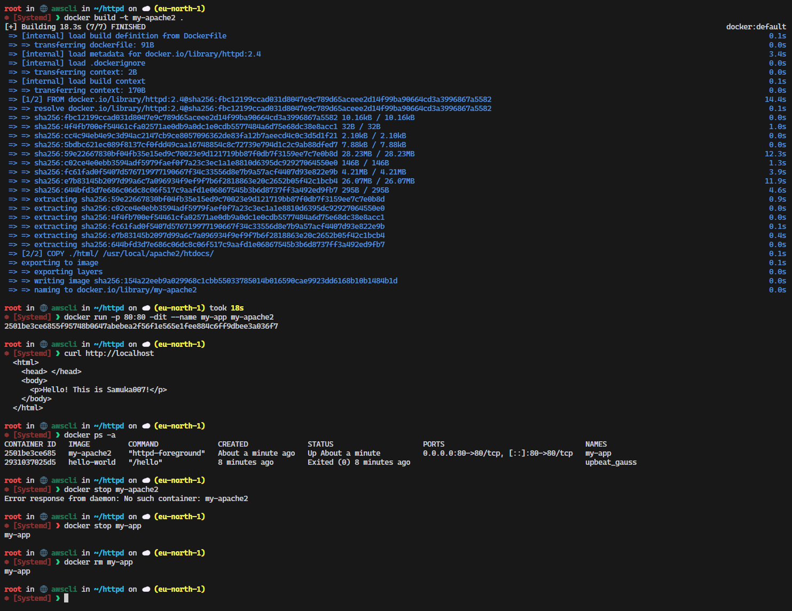

__Make a port forwarding and access through the web browser:__
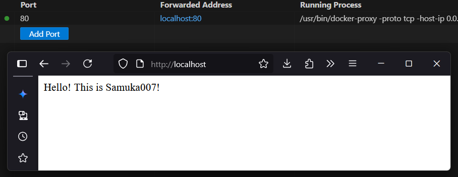

<div style="page-break-after: always;"></div>

# Lab 3

## Program

### [1] Preparation

Download the python code `cloudstorage.py` from the directory of [src](https://github.com/zhangzhics/CITS5503_Sem2/blob/master/Labs/src/cloudstorage.py) \
Create a directory `rootdir` \
Create a file in `rootdir` called `rootfile.txt` and write some content in it `1\n2\n3\n4\n5\n` \
Create a second directory in rootdir called `subdir`, and in the `subdir` directory create another file `subfile.txt` with the same content as `rootfile.txt`.

### [2] Save to S3 by updating `cloudstorage.py`

Modify the downloaded Python script, `cloudstorage.py`, to create an S3 bucket named `<student ID>-cloudstorage`.

When the program traverses the directory starting at the root directory `rootdir`, upload each file onto the S3 bucket. An easy way to upload files is to use the command below:

```
s3.upload_file()
```

**NOTE**: Make sure your S3 bucket has the same file structure as shown in `[1] Preparation`.

### [3] Restore from S3

Create a new program called `restorefromcloud.py` that reads the S3 bucket and writes the contents of the bucket within the appropriate directories. 

**NOTE**: Your local Linux environment should see a copy of the files and the directories from the S3 bucket.

### [4] Write information about files to DynamoDB

Install DynamoDB on your Linux environment

```
mkdir dynamodb
cd dynamodb
```

Install jre if not done: 

```
sudo apt-get install default-jre
wget https://s3-ap-northeast-1.amazonaws.com/dynamodb-local-tokyo/dynamodb_local_latest.tar.gz
```

You can use the following command to extract files from dynamodb_local_latest.tar.gz

```
tar -zxvf dynamodb_local_latest.tar.gz
```

After the extraction, run the command below

```
java -Djava.library.path=./DynamoDBLocal_lib -jar DynamoDBLocal.jar -sharedDb
```

Alternatively, you can use docker:
```
docker run -p 8000:8000 amazon/dynamodb-local -jar DynamoDBLocal.jar -inMemory -sharedDb
```
**Note**: Do not close the current window, open a new window to run the following Python script.

Write a Python script to create a table called `CloudFiles` on your local DynamoDB and the attributes for the table are:

```
        CloudFiles = {
            'userId',
            'fileName',
            'path',
            'lastUpdated',
	    'owner',
            'permissions'
            }
        )
```
`userId` is the partition key and `fileName` is the sort key. Regarding the creation, refer to this [page](https://boto3.amazonaws.com/v1/documentation/api/latest/reference/services/dynamodb.html)

Then, you need to get the attributes above for each file of the S3 bucket and then write the attributes of each file into the created DynamoDB table. Regarding how to get the attributes for a file, refer to this [page](https://boto3.amazonaws.com/v1/documentation/api/latest/reference/services/s3/client/get_object_acl.html)

**NOTE**: 

1) The table should have 2 items. One item corresponds to one file in the bucket and consists of the attributes above and their values.

2) Regarding the attribute `owner`, if you use a region in the table below, its value should be **owner's name**. Otherwise, its value should be **owner's ID**.

| Region | Region Name |
| --- | --- |
| US East (N. Virginia) | us-east-1 |
| Asia Pacific (Tokyo)	| ap-northeast-1 |
| Asia Pacific (Singapore) | ap-southeast-1 |
| Asia Pacific (Sydney)	| ap-southeast-2 |


### [5] Scan the table

Use the AWS CLI command to scan the created DynamoDB table, and output what you've got. 

### [6] Delete the table

Use the AWS CLI command to delete the table.

**NOTE**: Delete the created S3 bucket(s) from AWS console after the lab is done.

<div style="page-break-after: always;"></div>

# Lab 4

## Apply a policy to restrict permissions on the bucket

### [1] Write a Python script

Apply the following policy to the S3 bucket you created in the last lab to allow only your username to access the bucket. Make appropriate changes (e.g., `Resource`, `Condition`, etc) to the policy as necessary.

**NOTE**: in the policy below, you should replace `<your_s3_bucket>` with the S3 bucket you created and `<studentnumber>` with your own student number. You can use AWS console to create the S3 bucket in this lab that has the same contents as the bucket in the last lab.


```
{
  "Version": "2012-10-17",
  "Statement": [{
   "Sid": "AllowAllS3ActionsInUserFolderForUserOnly",
    "Effect": "DENY",
    "Principal": "*",
    "Action": "s3:*",
    "Resource": "arn:aws:s3:::<your_s3_bucket>/folder1/folder2/*",
    "Condition": {
      "StringNotLike": {
          "aws:username":"<studentnumber>@student.uwa.edu.au"
       }
    }
  }]
}
```


### [2] Check whether the script works

Use the AWS CLI command and the AWS S3 console to display the policy content applied to the S3 bucket. 

Test the policy by using a username that is not your own to access the folder called `rootdir` and output what you've got. 


## AES Encryption using KMS

### [1] Create a KMS key

Write a Python script to create a KMS key, where your student number works as an alias for the key.

### [2] Attach a policy to the created KMS key

Update the script to attach the following policy to the key.

**NOTE**: in the policy below, you should replace `<your_username>` with your own username.


```
{
  "Version": "2012-10-17",
  "Id": "key-consolepolicy-3",
  "Statement": [
    {
      "Sid": "Enable IAM User Permissions",
      "Effect": "Allow",
      "Principal": {
        "AWS": "arn:aws:iam::489389878001:root"
      },
      "Action": "kms:*",
      "Resource": "*"
    },
    {
      "Sid": "Allow access for Key Administrators",
      "Effect": "Allow",
      "Principal": {
        "AWS": "arn:aws:iam::489389878001:user/<your_username>"
      },
      "Action": [
        "kms:Create*",
        "kms:Describe*",
        "kms:Enable*",
        "kms:List*",
        "kms:Put*",
        "kms:Update*",
        "kms:Revoke*",
        "kms:Disable*",
        "kms:Get*",
        "kms:Delete*",
        "kms:TagResource",
        "kms:UntagResource",
        "kms:ScheduleKeyDeletion",
        "kms:CancelKeyDeletion"
      ],
      "Resource": "*"
    },
    {
      "Sid": "Allow use of the key",
      "Effect": "Allow",
      "Principal": {
        "AWS": "arn:aws:iam::489389878001:user/<your_username>"
      },
      "Action": [
        "kms:Encrypt",
        "kms:Decrypt",
        "kms:ReEncrypt*",
        "kms:GenerateDataKey*",
        "kms:DescribeKey"
      ],
      "Resource": "*"
    },
    {
      "Sid": "Allow attachment of persistent resources",
      "Effect": "Allow",
      "Principal": {
        "AWS": "arn:aws:iam::489389878001:user/<your_username>"
      },
      "Action": [
        "kms:CreateGrant",
        "kms:ListGrants",
        "kms:RevokeGrant"
      ],
      "Resource": "*",
      "Condition": {
        "Bool": {
          "kms:GrantIsForAWSResource": "true"
        }
      }
    }
  ]
}
```

### [3] Check whether the script works

Use the AWS KMS console to test whether your username is the key administrator and key user.
 
**NOTE**: After you log into the console, you perform the test by showing the policy you create, i.e., which ARN is the key administrator and which ARN is the key user.

### [4] Use the created KMS key for encryption/decryption

Write a Python script where each file from the S3 bucket is encrypted and then decrypted via the created KMS key. Both encrypted and decrypted files will be in the same folder as the original file. 

### [5] Apply `pycryptodome` for encryption/decryption

Write another Python script that uses the Python library `pycryptodome` to encrypt and decrypt each file in the S3 bucket. Both encrypted and decrypted files will be in the same folder as the original file.

For encryption/decryption, refer to the example code from [fileencrypt.py](https://github.com/zhangzhics/CITS5503_Sem2/blob/master/Labs/src/fileencrypt.py)

**NOTE**: Delete the created S3 bucket(s) and KMS key(s) from AWS console after the lab is done.

## Answer the following question in your lab report

*What is the performance difference between using KMS and using the custom solution?*

<div style="page-break-after: always;"></div>

# Lab 5

## Application Load Balancer

The aim of this part of the lab is to create an application load balancer and load balance requests to 2 EC2 instances. 

### [1] Create 2 EC2 instances

Write a Python Boto3 script to create 2 EC2 instances in two different availability zones (name the instances following the format: \<student number\>-vm1 and \<student number\>-vm2) in the region mapped to your student number. In this script, a security group should be created to authorise inbound traffic for HTTP and SSH, which will be used by the following steps. 

**NOTE**: Regarding your region name, find it in the table below based on your student number (If you cannot find your region name, it means you enrolled late and you should send an email to `cits5503-pmc@uwa.edu.au` requesting your region name.).

| Student Number | Region | Region Name | ami id |
| --- | --- | --- | --- |
| 21000000 - 23330000 | US East (N. Virginia) |	us-east-1 |	ami-020cba7c55df1f615 |
| 23330001 – 23625120 | Asia Pacific (Tokyo)	| ap-northeast-1	| ami-054400ced365b82a0 |
| 23625121 – 24030000 | Asia Pacific (Seoul)	| ap-northeast-2	| ami-0662f4965dfc70aca |
| 24030001 – 24122100 | US West (Oregon)	| us-west-2	| ami-05f991c49d264708f |
| 24122100 – 24237000 | Asia Pacific (Mumbai)	| ap-south-1	| ami-0f918f7e67a3323f0 |
| 24237001 – 24315000 | Asia Pacific (Singapore)	| ap-southeast-1	| ami-0497a974f8d5dcef8 |
| 24315001 – 24400000 | Asia Pacific (Sydney)	| ap-southeast-2	| ami-010876b9ddd38475e |
| 24400001 – 24497500 | Canada (Central)	| ca-central-1	| ami-0c0a551d0459e9d39 |
| 24497501 – 24590000 | Europe (Frankfurt)	| eu-central-1	| ami-02003f9f0fde924ea |
| 24590001 – 26000000 | Europe (Stockholm)	| eu-north-1	| ami-042b4708b1d05f512 |

### [2] Create an Application Load Balancer

Create an application load balancer and load balance HTTP requests to the created 2 instances. Note that the v2 of the ELB interface below should be used:

```
client = boto3.client('elbv2')
```

The script updates include:

First, create a load balancer, during which specify the two created region subnets and the
security group created in the previous step.

Second, create a target group using the same VPC that was used to create the instances.

Third, register targets in the target group.

Last, create a listener with a default rule Protocol: `HTTP` and `Port 80` forwarding on to the target group.

### [3] Test the Application Load Balancer

Try and access each EC2 instance using its public IP address in a browser. The load balancer is expected not to work at the moment, because Apache 2 is not installed in the instance. To make it work, follow the steps below:

First, ssh to each of the two instances. If you can't make it, try [here](https://bobbyhadz.com/blog/aws-ssh-permission-denied-publickey).

Second, update each instance:

```
sudo apt-get update
```

Third, install Apache2 in each instance:

```
sudo apt install apache2
```

Fourth, edit the `<title>` and `</title>` tags inside the `/var/www/html/index.html` file to show the instance name.

Last, use a browser from your host OS to access each instance by its respective IP address and see if you can get an Apache web page that shows your instance name. Output what you've got. If you are using the University network, it is likely that you cannot access the installed apache2. To address this issue, you may switch to a non-university network.

**NOTE**: Delete all the created AWS resources from the AWS console after the lab is done.
